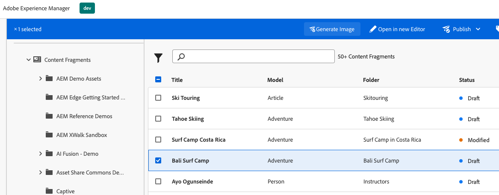
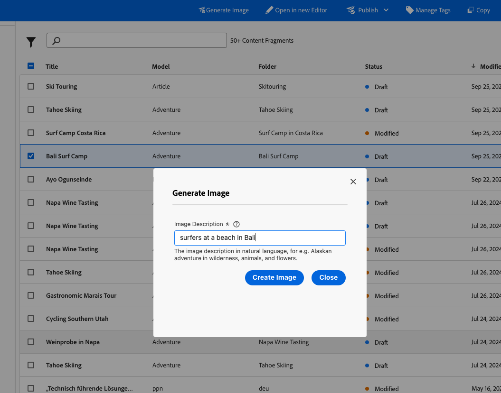
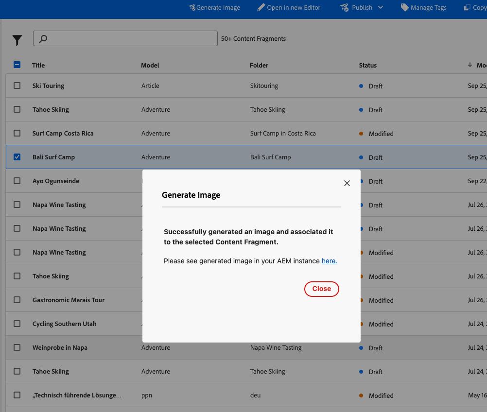
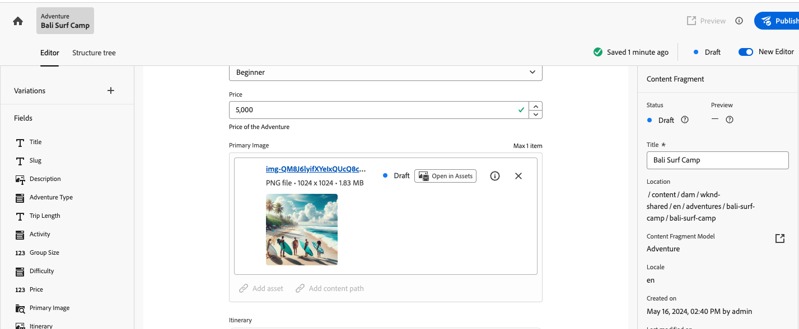

# OpenAI DALLE Content Fragment Admin using Extension Manager

Welcome to the OpenAI DALLE Content Fragment Admin using Extension Manager! This application integrates Adobe Experience Manager (AEM) with OpenAI's DALL-E to enable AI-powered image generation directly within your content management workflows. Enhance your digital asset management by seamlessly generating and managing AI-generated images.

## Key Features

This extension connects AEM to a third-party Generative AI (GenAI) service, specifically OpenAI's DALL-E. It includes:

- **Action Button in Content Fragment Console**: Easily access the image generation feature directly from the AEM Content Fragment Console.
  

- **User Prompt Modal**: A user-friendly modal for entering prompts to generate images.
  

- **Serverless Functionality**:
  - Generates an image through the third-party GenAI.
  
  - Uploads the generated asset to AEM Assets.
    

  - Links the asset to the relevant Content Fragment.
    

## Setup

- Populate the `.env` file in the project root and fill it as shown [below](#env)

## Local Development

- Run `aio app run` to start your local development server.
- The application will run on `localhost:9080` by default.

By default, the UI will be served locally, but actions will be deployed and served from Adobe I/O Runtime. To start a local serverless stack and also run your actions locally, use the `aio app run --local` option.

## Testing & Coverage

- Run `aio app test` to execute unit tests for both UI and actions.
- Run `aio app test --e2e` to execute end-to-end tests.

## Deployment & Cleanup

- Use `aio app deploy` to build and deploy all actions on Runtime and static files to the CDN.
- Use `aio app undeploy` to remove the deployed app.

## Configuration

### `.env`

You can generate this file using the command `aio app use`. 

```bash
# This file must **not** be committed to source control

## Please provide your Adobe I/O Runtime credentials
# AIO_RUNTIME_AUTH=
# AIO_RUNTIME_NAMESPACE=
````

### `app.config.yaml`

- This is the main configuration file that defines the application's implementation. 
- More information on this file, application configuration, and extension configuration can be found [here](https://developer.adobe.com/app-builder/docs/guides/appbuilder-configuration/#appconfigyaml).

#### Action Dependencies

- You have two options to resolve your actions' dependencies:

  1. **Packaged action file**: Add your action's dependencies to the root `package.json` and install them using `npm install`. Then set the `function` field in `app.config.yaml` to point to the **entry file** of your action folder. We will use `webpack` to package your code and dependencies into a single minified JS file. The action will then be deployed as a single file. Use this method if you want to reduce the size of your actions.

  2. **Zipped action folder**: In the folder containing the action code, add a `package.json` with the action's dependencies. Then set the `function` field in `app.config.yaml` to point to the **folder** of that action. We will install the required dependencies within that directory and zip the folder before deploying it as a zipped action. Use this method if you want to keep your action's dependencies separated.

## Debugging in VS Code

While running your local server (`aio app run`), both UI and actions can be debugged. To do so, open the VS Code debugger and select the debugging configuration called `WebAndActions`. Alternatively, there are also debug configurations for only UI and each separate action.

This application is ideal for developers and content creators looking to leverage AI in their digital asset management processes, providing a seamless integration of AI-generated content within AEM.
